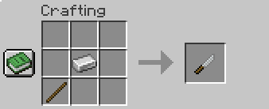
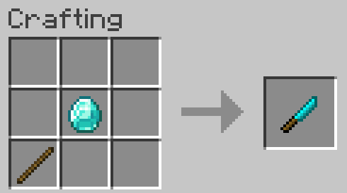
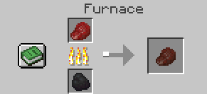
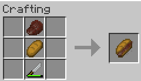
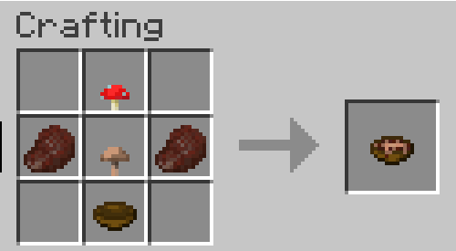

# Recipes – Eat Yourself! 🍴

## Iron Knife Crafting
**Ingredients:** 1 Iron Ingot, 1 Stick

**Recipe Image:**

## Diamond Knife Crafting
**Ingredients:** 1 Diamond, 1 Stick

**Recipe Image:**

## Cooking Raw Player Meat
**Ingredients:** 1 Raw Player Meat

**Recipe Image:**

## Player Meat Sandwich Crafting
**Ingredients:** 1 Bread, 1 Cooked Player Meat, 1 Knife

**Recipe Image:**

## Player Meat Soup Crafting
**Ingredients:** 1 Bowl, 1 Red Mushroom, 1 Brown Mushroom, 2 Cooked Player Meat

**Recipe Image:**

